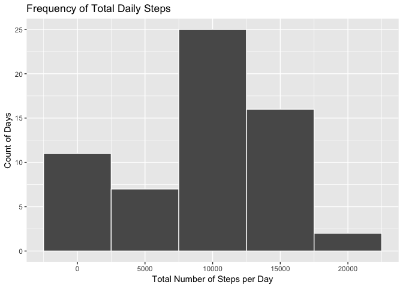
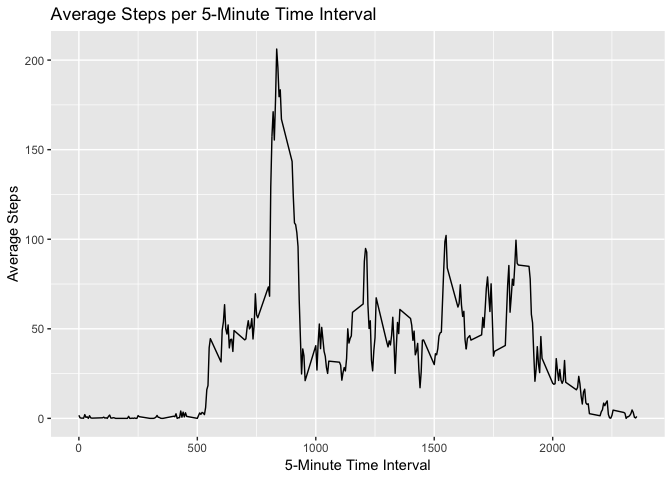
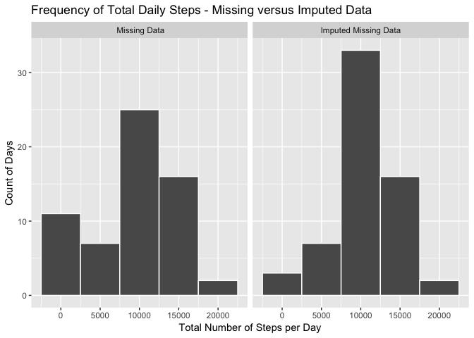
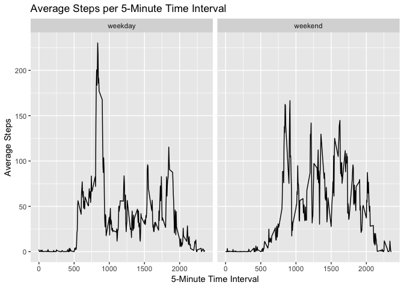

This document contains the markdown for my submission to Coursera's Reproducible Research Week 2 Project. 

  The dataset contains step activity from a fitness tracker (Jawbone, Fitbit, Apple Watch, etc). The data is very straightforward and contains the date, a time interval (5 minute interval), and the number of steps taken in that interval. There are missing values, and the first half of the analysis looks at the data unaltered, and the second half imputes the missing values and examines the modified data. My analysis examines the total number of steps per day, the average daily activity pattern (how many steps are typically taken during a time period), and the difference in activity between week and weekend days.

  Some quick highlights of the analysis:
  - Approximately 10,000 steps are taken per day. Most fitness trackers set a default goal of 10,000 steps, so our subject is meeitng his or her goals!
  - Weekday activity peaks earlier in the day, and weekend end activity is smoother and starts later in the day.
  - An average of 200 steps are taken during a 5 minute time window.

Load all our required libraries.

  
## Loading and preprocessing the data

Load in our data using the read.csv function. This assumes the data is already in your working directory.

 steps  date          interval
------  -----------  ---------
    NA  2012-10-01           0
    NA  2012-10-01           5
    NA  2012-10-01          10
    NA  2012-10-01          15
    NA  2012-10-01          20

***

## What is the mean total number of steps taken per day?

### 1. Make a histogram of the total number of steps taken each day
  
  In order to make a histogram of the total steps per day, we'll first create a summary table using the dplyr group_by and summarize functions to group our data by date, and calculate the sum of steps per date to get our totals. As the instructions say we can ignore the missing values at this point in the analysis, we'll use the na.rm option of the sum function to remove the NA's in our dataset.  
  
  Then, we'll use ggplot's geom_histogram function to create a histogram. For readability, I've set the buckets to 5,000 steps (note this is the result when using the base plotting system's hist function.) I've also set the bar outlines to white, also for readability.
  
  You can see that with a number of values missing (we'll get to the exact number of rows in a bit!), there are a quite a few days below 10,000 total steps. The 10,000 to 14,999 step bucket is our most frequent, which makes some sense - many fitness trackers set a default goal of 10,000 steps per day.

<!-- -->

***

### 2. Calculate and report the mean and median total number of steps taken per day

Since we already have a summarized data frame with the total steps per day, we'll just use that to calculate the mean and median.

The **mean** of total daily steps is **9354.23** and the **median** is **10395**.

***

## What is the average daily activity pattern?

### 1. Make a time series plot (i.e. `type = "l"`) of the 5-minute interval (x-axis) and the average number of steps taken, averaged across all days (y-axis)
  
  Just like when we made our histogram above, we'll start by creating a summary table with the average number of steps taken by time interval. Again, we are still using the na.rm option to ignore our NA's. 
  
  After our table is generated, we can use ggplot's geom_line to create the line plot specified by the instructions. From 0 to 500 minutes, there is not a lot of step activity - makes sense, most folks are asleep then! Around minute 800 we see a very large peak - around 1:30PM. Very interesting!

<!-- -->

***

### 2. Which 5-minute interval, on average across all the days in the dataset, contains the maximum number of steps?

 interval   avgsteps
---------  ---------
      835   206.1698

The 5-minute interval **835** has the highest average steps, at **206.17**.

***

## Imputing missing values

### 1. Calculate and report the total number of missing values in the dataset (i.e. the total number of rows with `NA`s)

  Per our instructions, we've ignored our missing values thus far through our analysis. We know they exist, as the first few rows have NA's for steps. But we don't know how bad the problem is right now! Our dataset only has three columns so it's easy to check for the number of rows with missing values for each column.
  
  We'll do this using a combination of the nrow function (counts the rows), dyplr's maggittr (pipe) and filter (does what it says it does), and finally, the is.na function. We'll use dplyr to filter the dataframe to just the rows where one of our columns is missing, and nrow to count those rows.

There are 2304 rows with missing steps, 0 rows with missing intervals, and 0 with missing dates. 

***

### 2. Devise a strategy for filling in all of the missing values in the dataset. The strategy does not need to be sophisticated. For example, you could use the mean/median for that day, or the mean for that 5-minute interval, etc.. Create a new dataset that is equal to the original dataset but with the missing data filled in.

  Now that we know how many missing values we have, it's time to give them a value. There are a number of options here - you can assume missing values are due to a lack of movement and impute them all as zero. You can assume a given interval will mimic the day's average and replace each missing value with the average steps per day. Or, you can assume that step counts per time interval are relatively consistent day to day, and use the dataset's average per time period as the imputation. The last option is what I went with! 
  
  Note that averages are often decimals, but steps are whole numbers. For ease of use, I've rounded each mean to the nearest whole number and used that as our imputation.
  
  In order to replace the values, I'm actually using the dataframe I created for my Average Steps per 5-Minute Time Interval plot above. I use the left_join function from dplyr to join the summarized table to our raw data by the interval field. Then, I create a new column to make sure I can double check my work - it's filled with an ifelse statement that checks if the raw step count is NA, replaces it with the average if that is the case. If not, it uses the raw step count as the field's value. Finally, I'm renaming the new step count to the old field name and selecting just that field, the date, and the time interval.

 steps  date          interval
------  -----------  ---------
     2  2012-10-01           0
     0  2012-10-01           5
     0  2012-10-01          10
     0  2012-10-01          15
     0  2012-10-01          20

***

### 4. Make a histogram of the total number of steps taken each day and Calculate and report the mean and median total number of steps taken per day. Do these values differ from the estimates from the first part of the assignment? What is the impact of imputing missing data on the estimates of the total daily number of steps?

  Just like our first histogram, I need to create a summary table with the total steps grouped by date. I'll do this the exact same way, replacing just the first reference to the raw data with our new.act table that now contains imputed values.
  
  Jumping a little ahead, the assignment asks us to compare the imputed totals against the non-imputed totals, so I added a new field to the two summarized dataframes with totals to distinguish between the two datasets. This allows me to use ggplot's facet_grid option to show side by side histograms to really illustrate the difference. The bulk of the code for the plot is the same, with that addition. 
  
  As we can see, using the mean per time interval to replace missing values redistributes days from our lower step count buckets (0-4999 and 5000-9999) to the 10000-14999 step buckets. This makes sense - our missing values were essentially ignored before, so imputing can only increase a day's total step value.
  
  The instructions also ask for a calculation of the mean and median for the newest data set, which you'll find below the graph. I've also included a comparison against the non-imputed dataset to quantify the impact of the imputation.

<!-- -->
       
 
There is an increase of 1,411 in average steps and 367 median steps comparing the imputed data to the original data.

type                        mean   median
---------------------  ---------  -------
Missing Data             9354.23    10395
Imputed Missing Data    10765.64    10762
***

## Are there differences in activity patterns between weekdays and weekends?

### 1. Create a new factor variable in the dataset with two levels -- "weekday" and "weekend" indicating whether a given date is a weekday or weekend day

Our first step here is to convert the date variable to a date type - previously it was character. Next, we'll use the weekdays function to identify the day of the week for all of our dates, and create an ifelse forumla that assigns "weekend" to Saturdays and Sundays, and "weekdays" to all other days. Our final step is to make that daytype a factor and limit our dataset to just the fields we need. 

### Make a panel plot containing a time series plot (i.e. `type = "l"`) of the 5-minute interval (x-axis) and the average number of steps taken, averaged across all weekday days or weekend days (y-axis).

  Next we'll make our plot! First, we'll create a summary dataframe, similar to how we created other charts in this analysis. This time though, we'll need to group by two variables - our newly created daytype and the interval variable. The daytype will actually be used as our faceting variable when when create our panel plot. You'll notice that we've removed the na.rm optio within the mean function - since we've imputed the missing variables, we no longer need to ignore any NA's - there aren't any!
  
  Next we'll use ggplot to create our panel plot. ggplot has a built in option - facet_grid - that makes it very easy to create panel plots. 
  
  Once we've built our plot, we can see the weekend days show a very different pattern than the weekdays! The weekdays show a large peak in the first half of the day, and activity tapers from there. Activity on the weekends is shifted a little later in the day, and is smoother throughout - no large individual peaks.

  
<!-- -->

